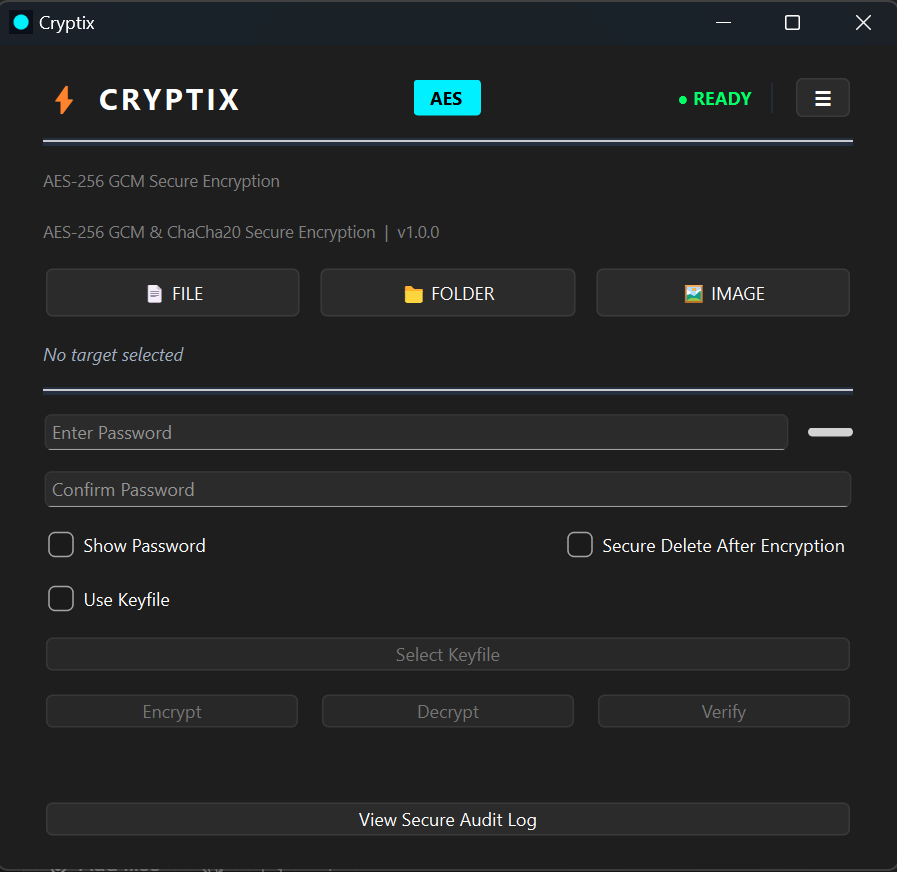
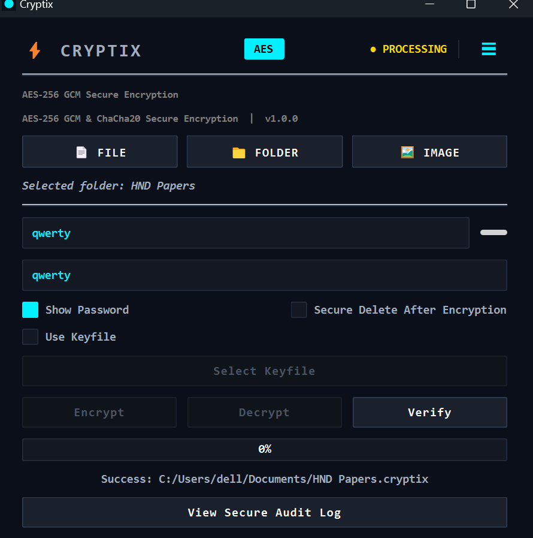
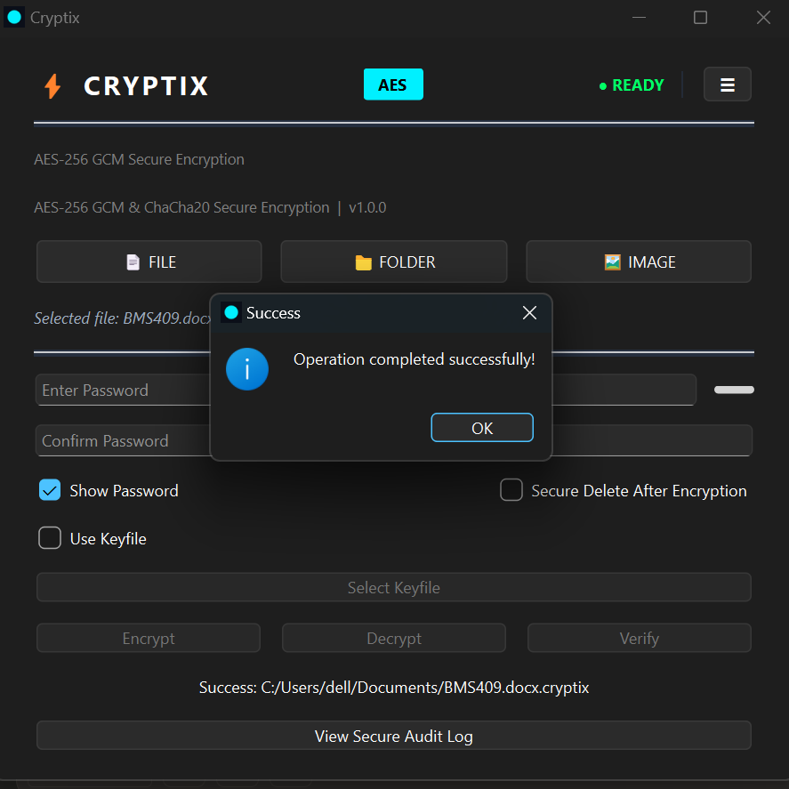
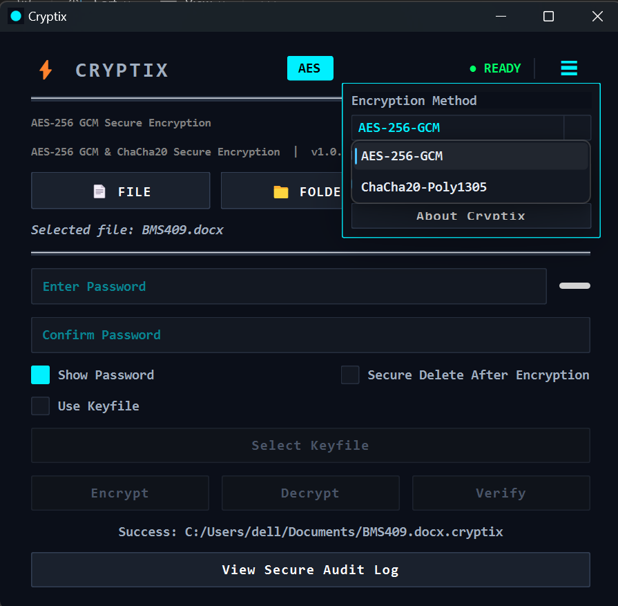
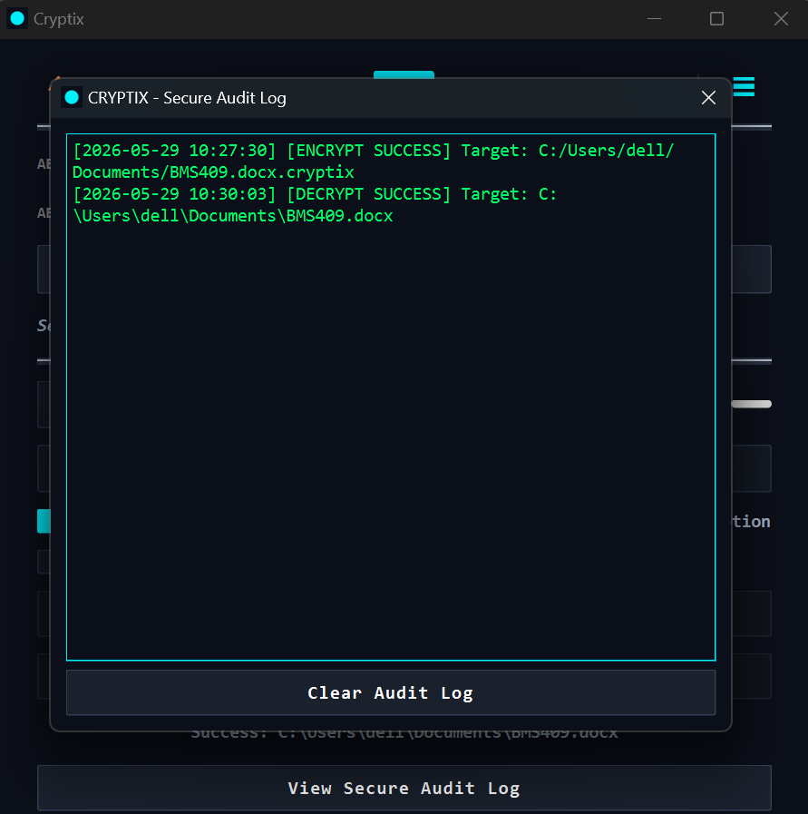
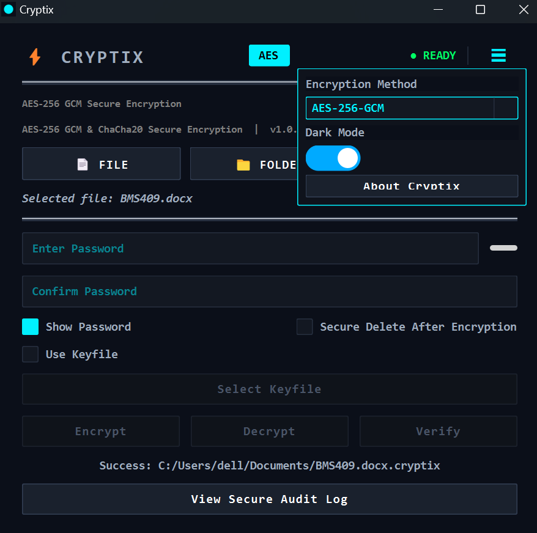

# Cryptix v1.2.0

Secure local file encryption for Windows with AES‑256‑GCM, ChaCha20‑Poly1305, and Argon2id.

Current Stable Version: v1.2.0
Multi‑Algorithm Authenticated Encryption Suite
Cryptix is a security‑focused desktop encryption application designed to provide structured, authenticated local file protection using modern cryptographic primitives.

It implements:

- AES‑256‑GCM (AEAD)
- ChaCha20‑Poly1305 (AEAD)
- Argon2id memory‑hard key derivation
- Authenticated metadata binding (AAD)
- Structured, versioned encrypted container format

Cryptix is built as a modular, security‑oriented platform rather than a simple encryption wrapper.

---

# Core Security Features

- ✅ AES‑256‑GCM authenticated encryption  
- ✅ ChaCha20‑Poly1305 authenticated encryption  
- ✅ Argon2id password‑based key derivation (100MB memory configuration)  
- ✅ Metadata authentication using AEAD Additional Authenticated Data (AAD)  
- ✅ Structured binary container format with versioning  
- ✅ Streaming encryption/decryption for large files  
- ✅ File integrity verification mode  
- ✅ Secure delete option (basic overwrite)  
- ✅ Lockout mechanism (anti brute‑force protection)  
- ✅ Encrypted audit logging with tamper detection  
- ✅ Keyfile support (optional second factor)  
- ✅ Dark mode UI (PySide6)  

# What's New in v1.2.0

### Usability Improvements
- ✅ Drag-and-drop file and folder support with visual overlay feedback
- ✅ Built-in secure password generator
- ✅ Multi-file batch encryption, decryption, and verification
- ✅ Improved password strength indicator (compact, dynamic progress bar)
- ✅ Post-decryption secure delete option
- ✅ Refined single-file success messaging for batch operations

### Workflow Enhancements
- ✅ Consistent batch behavior across encrypt, decrypt, and verify
- ✅ Improved user feedback and UI clarity
- ✅ Strengthened folder secure deletion handling

### System Integration
- ✅ Windows installer with desktop and Start Menu integration
- ✅ `.cryptix` file association (double‑click support)
- ✅ Automatic GitHub update checker
- ✅ Persistent user settings (theme, algorithm, secure delete preferences)
- ✅ Performance benchmark mode

---

# Architecture Overview

Cryptix follows a modular architecture:

```
GUI (PySide6)
        ↓
Controller / Worker Thread
        ↓
Core Encryption Engine
        ↓
File Handler (Container Format + AAD)
        ↓
Logger (Encrypted Audit Log)
```

Cryptographic logic is fully separated from the GUI layer.

---

# Screenshots

## Main Interface


## Encryption in Progress


## Successful Encryption


## Algorithm Selection


## Audit Log Viewer


## Dark Mode 


# File Format Specification

Encrypted files follow a structured binary layout:

```
[MAGIC]
[VERSION]
[ALGORITHM]
[SALT]
[IV]
[TAG]
[FILENAME_LENGTH]
[FILENAME]
[CIPHERTEXT]
```

Metadata fields are authenticated using AEAD Additional Authenticated Data (AAD).  
Any modification to header or filename results in authentication failure.

See: `FILE_FORMAT.md` for full specification.

---

# Threat Model Summary

Cryptix is designed to protect:

- Local confidential files
- Stolen storage devices
- Offline file analysis
- File tampering attempts

Cryptix does **NOT** protect against:

- Malware infections
- Keyloggers
- Compromised operating systems
- Weak user passwords
- Physical attacks on active systems

See: `THREAT_MODEL.md` for full threat model.

---

# Download (Windows)

1. Go to the **Releases** section.
2. Download the latest installer:
   `Cryptix_Installer_v1.2.0.exe`
3. Run the installer.
4. Launch Cryptix from Desktop or Start Menu.

`.cryptix` files can be opened directly by double‑clicking.

# Installation

Clone the repository:

```bash
git clone https://github.com/SPMI237/cryptix.git
cd cryptix
```

Create a virtual environment:

```bash
python -m venv venv
venv\Scripts\activate
```

Install dependencies:

```bash
pip install -r requirements.txt
```

Run:

```bash
python main.py
```

---

## Tested Environment

- Python 3.13.x
- Windows 10 / Windows 11
- PySide6 6.11.1
- PyCryptodome 3.23.0

# Building Executable (Windows)

Cryptix can be packaged using PyInstaller:

```bash
python build.py
```

The executable will be generated in the `dist/` directory.

---

# Security & Trust

Cryptix is built on the principle of transparency. We do not use hidden mechanisms or legacy cryptography.

For detailed technical information, please review our documentation:
- [Platform Vision](docs/PLATFORM_VISION.md)
- [Security Review](docs/SECURITY_REVIEW_v1.2.md)
- [Release Policy](docs/RELEASE_POLICY.md)
- [File Format Specification](FILE_FORMAT.md)
- [Threat Model](THREAT_MODEL.md)

# Security Notice

Cryptix uses modern authenticated encryption primitives and memory‑hard key derivation.

However, security depends on:

- Strong password selection
- Secure operating system environment
- Protection against malware
- Safe device handling

Cryptix reduces risk but does not eliminate all attack vectors.

---

# License

Cryptix is distributed under the Cryptix Source‑Available License v1.0.

Source code is available for audit, educational use, and non‑commercial use.

See `LICENSE` for full terms.

---

# Author

Michel Idriss

---